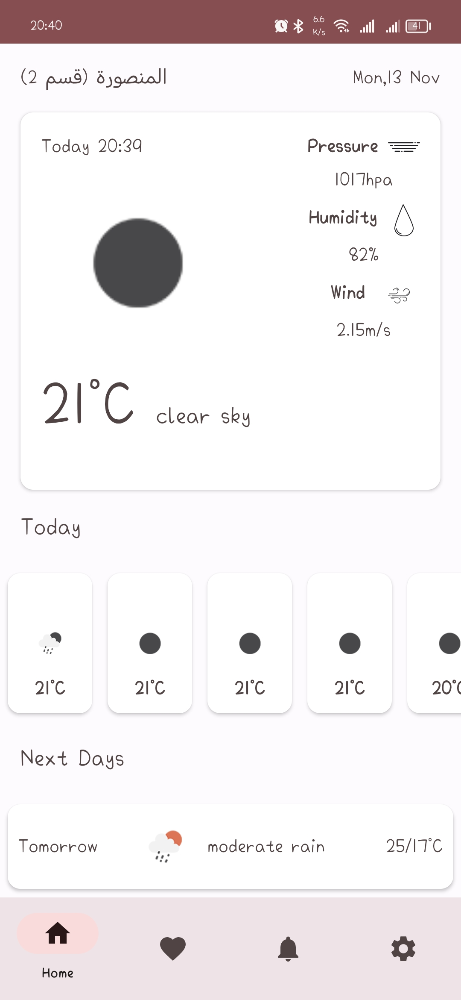
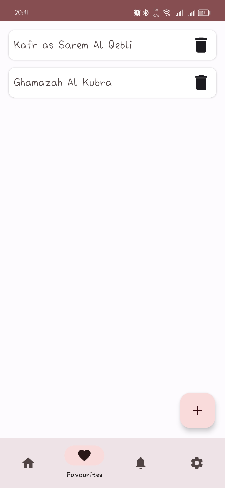
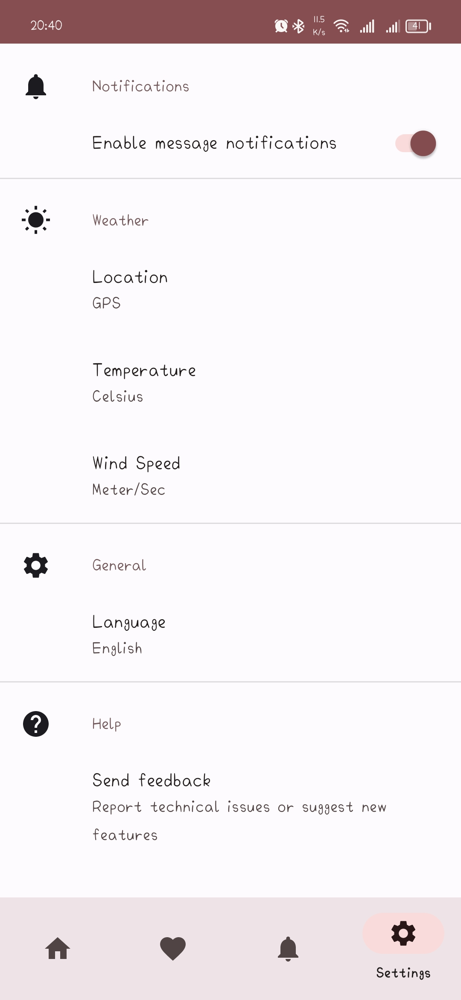

# Weather Forecast
Weather Forecast is a native Android mobile application that uses Kotlin Programming Language to help users know weather in any locatoin.

##Application Features:
* Get weather from location or map.
* Save location and weather to local database.
* Get alarms to weather.
* Change units and language of the app.

## Tools used
* MVVM Architecture Pattern
* Kotlin
* XML
* Coroutines
* Kotlin Flow
* Room
* Retrofit
* Glide
* Recycler View
* Material Design 3
* Navigation Component
* Unit Testing
* Alarm Manager

## API used
[OpenWeatherMap API](https://openweathermap.org/api/one-call-api)

## Downloads
[APK Download](https://drive.google.com/file/d/1sJtblOJ2q-t83_wgjZUtVY3ZNfbvbQv-/view?usp=sharing)

## Screenshots

  
  
  

